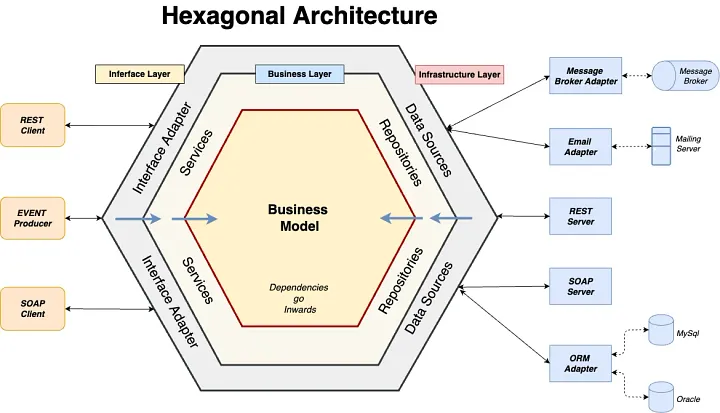
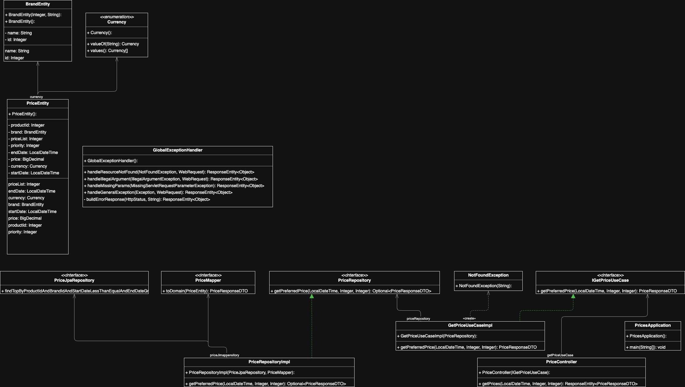
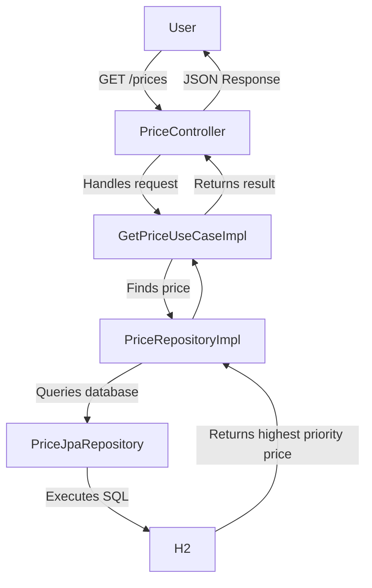

# Inditex App Project

## 📄 Description

This project implements a price management service based on **Java 17**, using **H2** as an in-memory database. It is built with **Spring Boot** and **JPA** for data management.

---

## 🧾 Business Context: PRICES Table

In the company's e-commerce database, the `PRICES` table stores the final price (PVP) and the price list applicable to a product from a specific brand over a date range.

**Sample data:**

| BRAND_ID | START_DATE         | END_DATE           | PRICE_LIST | PRODUCT_ID | PRIORITY | PRICE | CURR |
|----------|--------------------|--------------------|------------|------------|----------|--------|------|
| 1        | 2020-06-14 00:00:00 | 2020-12-31 23:59:59 | 1          | 35455      | 0        | 35.50 | EUR  |
| 1        | 2020-06-14 15:00:00 | 2020-06-14 18:30:00 | 2          | 35455      | 1        | 25.45 | EUR  |
| 1        | 2020-06-15 00:00:00 | 2020-06-15 11:00:00 | 3          | 35455      | 1        | 30.50 | EUR  |
| 1        | 2020-06-15 16:00:00 | 2020-12-31 23:59:59 | 4          | 35455      | 1        | 38.95 | EUR  |

**Field Descriptions:**

- `BRAND_ID`: Brand ID (e.g., 1 = ZARA).
- `START_DATE`, `END_DATE`: Date range for which the price applies.
- `PRICE_LIST`: Price list identifier.
- `PRODUCT_ID`: Product identifier.
- `PRIORITY`: If date ranges overlap, the entry with the highest priority is used.
- `PRICE`: Final sale price.
- `CURR`: Currency (ISO code).

---

## 🧩 Service Requirements

Build a Spring Boot REST API that:

- Accepts: `applicationDate`, `productId`, `brandId`
- Returns: `productId`, `brandId`, `priceList`, `startDate`, `endDate`, `price`

Preload the H2 in-memory database with the sample data. You may rename fields and add others as needed.

### ✅ Required Test Cases

| Test | Description                                              |
|------|----------------------------------------------------------|
| 1    | Request at 10:00 on June 14 for product 35455, brand 1   |
| 2    | Request at 16:00 on June 14 for product 35455, brand 1   |
| 3    | Request at 21:00 on June 14 for product 35455, brand 1   |
| 4    | Request at 10:00 on June 15 for product 35455, brand 1   |
| 5    | Request at 21:00 on June 16 for product 35455, brand 1   |

---

## 💻 Technologies Used

- **Java 17** – Main programming language
- **Spring Boot** – Backend application framework
- **JPA** – Persistence layer
- **H2** – In-memory database
- **Swagger & OpenAPI** – API documentation and client generation
- **Docker & Docker Compose** – Containerization and orchestration

---

## 🏛️ Architecture

A **Hexagonal Architecture (Ports & Adapters)** is used, separating business logic from infrastructure.


```
com.prices.inditex
│── application
│   ├── port
│   │   └── IGetPriceUseCase.java
│   ├── service
│   │   └── GetPriceUseCaseImpl.java
│
│── domain
│   ├── exception
│   │   └── NotFoundException.java
│   ├── repository
│   │   └── PriceRepository.java
│
│── infrastructure
│   ├── controller
│   │   └── PriceController.java
│   ├── exception
│   │   └── GlobalExceptionHandler.java
│   ├── mapper
│   │   └── PriceMapper.java
│   ├── repository
│   │   ├── entity
│   │   │   ├── BrandEntity.java
│   │   │   ├── Currency.java
│   │   │   ├── PriceEntity.java
│   │   ├── jpa
│   │   │   ├── PriceJpaRepository.java
│   │   │   ├── PriceRepositoryImpl.java
│
│── InditexApp.java
```

---
## 🔄 Class Diagram

---

## 🔄 Price Query Processing Flow



---

## 📘 Documentation

The API is documented using Swagger (OpenAPI). Controllers and DTOs are generated automatically.

### 📌 Endpoint

#### GET `/prices`

**Query Parameters:**

| Name            | Type    | Required | Description                              |
|-----------------|---------|----------|------------------------------------------|
| applicationDate | String  | Yes      | In format `YYYY-MM-DDTHH:MM:SS`          |
| productId       | Integer | Yes      | Product ID                               |
| brandId         | Integer | Yes      | Brand ID                                 |

**Example:**

```
GET http://localhost:8080/prices?applicationDate=2025-06-14T15:01:00&productId=35455&brandId=1
```

**Response:**

```json
{
    "productId": 35455,
    "brandId": 1,
    "priceList": 2,
    "startDate": "2025-06-14T15:00:00",
    "endDate": "2025-06-14T18:30:00",
    "price": 25.45
}
```

---

## ▶️ Local Execution

1. Compile the project:
```bash
mvn clean package
```

2. ### Running the Project

```bash
./mvnw clean spring-boot:run
# or
mvn clean spring-boot:run
```

3. Access:
- [Swagger UI](http://localhost:8080/swagger-ui/index.html)

- [Consulta de precios en local](http://localhost:8080/prices?applicationDate=2025-06-14T15:01:00&productId=35455&brandId=1)

---

```

## 👤 Author

Developed by **Enrique Navarro**  
Senior Software Engineer  
📍 Madrid, Spain
